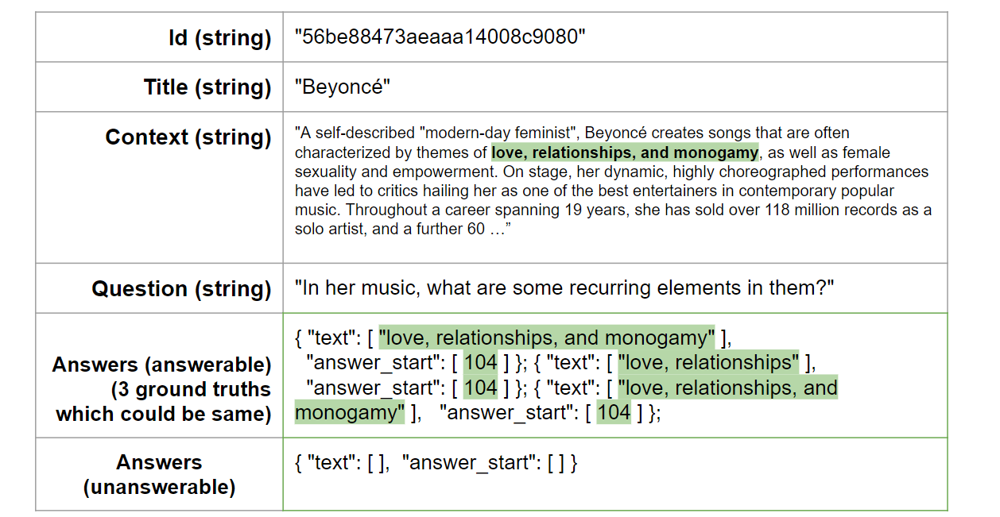

# QA Task - BiDAF on SquadV2.0
Our implementation for question answer model - Bidiretional Attention Flow (BiDAF). 

## Squad2.0 Dataset 

### Dataset Description
Stanford Question Answering Dataset (SQuAD) is a reading comprehension dataset, consisting of questions posed by crowdworkers on a set of Wikipedia articles, where the answer to every question is a segment of text, or span, from the corresponding reading passage, or the question might be unanswerable. 

**Stanford Question Answering Dataset (SQuAD)** is a reading comprehension dataset from [Stanford](https://rajpurkar.github.io/SQuAD-explorer/), consisting of questions posed by crowd workers on a set of Wikipedia articles, where the answer to every question is a segment of text, or span, from the corresponding reading passage, or the question might be unanswerable.
**SQuAD2.0 combines the 100,000 questions in SQuAD1.1 with over 50,000 unanswerable questions** written adversarially by crowd workers to look similar to answerable ones. To do well on SQuAD, the model has to struggle with the unanswerable ones when answers seem most likely supported by the context. 
Training and development and testing data are split into separate datasets, and the testing set is hidden for an official evaluation of models. Both the training and development datasets are nested dictionaries, we can use the key of *'data'* to get all the necessary context-question-answer triples for the training and evaluation process. The summarizations of datasets are shown in below table.  
A data sample can be seen in figure. **It should be noted that each question with a unique id could be answerable or unanswerable, for answerable ones, we could get 3 ground truths that may be different or identical to each other; for unanswerable ones, the annotations of answer text and answer start are just empty lists. The mislabel means answers but with mislabeled start position.**   

| Dataset | Total Articles | Answerable | Unanwerable | Mislabeled | Total Examples |
|---------|----------------|------------|-------------|------------|----------------|
| Train   | 442            | 86,821     | 43,498      | 905        | 130,319        |
| Dev     | 35             | 5,945      | 5,928       | 52         | 11，873         |

Data sample in SquadV2.0 is shown 

### Squad2.0 Dataset Structure

📦Squad2.0

 ┣ 📂data

 ┃ ┣ 📂paragraphs
 
┃ ┃ ┣ 📂context

 ┃ ┃ ┗ 📂qas

 ┃ ┃ ┃ ┣ 📂answers

 ┃ ┃ ┃ ┗ 📂question

 ┃ ┗ 📂title

 ┗ 📂version

 ### Data Preprocess 
#### SquadV2.0 vs SquadV1.0 
Here we define 2 ways to pre-process the SquadV2.0 dataset to get context-question-answer triples for training and validation. 
* One way is to exclude all the questions without any answer. 
* The other way we include all the questions with or without answers. 
In both of the cases, we delete the mis-labeled data in train set. 

 ## BiDAF Model

 BiDAF is a multi-stage hierarchical process that represents the context at **different levels of granularity, including character-level, word-level, and contextual embeddings, and uses a bidirectional attention flow mechanism to obtain a query-aware context representation without early summarization**. What's more, **it divides the labor between the attention layer and the modeling layer**, forces the attention layer to focus on learning the attention between the query and the context and enables the **modeling layer to focus on learning the interaction within the query-aware context representation (the output of the attention layer)**. BiDAF structure is shown below. 
 

 ## Usage 

# Requirements

- `Python 3.6`

# Code Organization

    ├── config.py          <- Configuration file with data directories and hyperparamters to train the model
    ├── data_loader.py     <- Define an iterator who collects batches of data to train the model
    ├── eval.py            <- Evaluate the model on a new pair of (context, question)
    ├── layers.py          <- Define the various layers to be used by the main BiDAF model
    ├── make_dataset.py    <- Download the SquAD dataset and pre-process the data for training
    ├── model.py.          <- Define the BiDAF model architecture
    ├── requirements.txt   <- Required Python libraries to build the project
    ├── test.py            <- Test the performance of a trained model on the DEV dataset
    ├── train.py           <- Train a model using the TRAIN dataset only
    ├── utils.py           <- Group a bunch of useful functions to process the data

# Results

Exact-Match and F1 Score on Validation set after training:

| EM  | F1  |
| ----|:---:|
| 0.64| 0.75|

# Set-Up

* Clone the repository
* Create a directory for your experiments, logs and model weights: `mkdir output`
* Download GloVE word vectors: https://nlp.stanford.edu/projects/glove/
* Modify the `config.py` file to set up the paths where your GloVE, SquAD and models will be located
* Create a Python virtual environment, source to it: `mkvirualenv qa-env ; workon qa-env` if you use virtualenvwrapper
* Install the dependencies: `pip install -r requirements.txt ; python -m spacy download en`
* Run `python make_dataset.py` to download SquAD dataset and pre-process the data
* Run `python train.py` to train the model with hyper-parameters found in `config.py`
* Run `python test.py` to test the model EM and F1 scores on Dev examples
* Play with `eval.py` to answer your own questions! :)

## Evaluation 
### Human Performance 
**Human Performance on SquadV2.0, EM equals to 86.831, F1 score equals to 89.452**

### Evaluation Metrics 
Usually in many papers they are using the ExactMatch (EM) and F1 scores evaluated on the development set of SQuAD v2.0. 
* **ExactMatch** Measure the proportion of answer text matching ground truth exactly. For instance, \textbf{if the ground truth is 'The Variances in nomenclature.', after normalization, it would be 'variances in nomenclature'}, and the resulting text needs to match this text exactly. 
* **F1 Score** Split both predicted answer and ground truth into a sequence of words, and calculate the f1 score. 

It's worth noting that for each question SquadV2.0 dataset has **3 ground truths** to compute the evaluation metrics, we compute all of them and **take the maximum score for the final evaluation**. In our implementation, we modify the official evaluation code to **adapt to hugging face metrics since it supports calculating the metric separately on questions with answers and without an answer**, which includes **exact\_match, f1, HasAns\_exact, NoAns\_exact, NoAns\_f1, HasAns\_f1, best\_f1, best\_exact**.  

